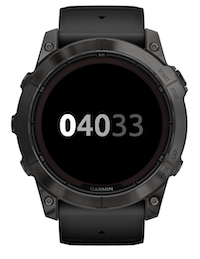
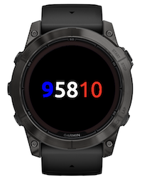

# Garmin French Time

A minimalist, elegant, nerdy Garmin Connect IQ watch face that displays the current time as French Revolutionary time.


Available from [Garmin Connect IQ Developer portal](https://apps.garmin.com/apps/a42c7074-1059-4012-99cc-dee244688145).

> **Note**  
> Swatch Time is part of a [collection of unconventional Garmin watch faces](https://github.com/wkusnierczyk/garmin-watch-faces). It has been developed for fun, as a proof of concept, and as a learning experience.
> It is shared _as is_ as an open source project, with no commitment to long term maintenance and further feature development.
>
> Please use [issues](https://github.com/wkusnierczyk/garmin-french-time/issues) to provide bug reports or feature requests.  
> Please use [discussions](https://github.com/wkusnierczyk/garmin-french-time/discussions) for any other comments.
>
> All feedback is wholeheartedly welcome.

## Contents

* [French Revolutionary time](#french-revolutionary-time)
* [Features](#features)
* [Project structure](#project-structure)
* [Build, test, deploy](#build-test-deploy)

## French Revolutionary time

[French Revolutionary Time](https://en.wikipedia.org/wiki/Decimal_time) (also known as _Decimal time_) represents the time of day using units which are decimally related.
The day is divided into **10 decimal hours**, each decimal hour into **100 decimal minutes** and each decimal minute into 100 decimal seconds.

The Garmin French Time watch face displays the time as `decimal hours` `decimal minutes` `decimal seconds` (separated by space, distinguished by font weight and color).
Optionally, the user may turn on standard time, displayed in smaller font below the decimal time, using on-watch customization settings.

The watch face uses custom fonts.
The font presented here is [Ubuntu](https://fonts.google.com/specimen/Ubuntu), available from [Google Fonts](https://fonts.google.com/) as a True Type font (`ttf`).
It has been converted to a bitmap font (`bmp`, `fnt`) using the open source command-line [`ttf2bmp`](https://github.com/wkusnierczyk/ttf2bmp) converter.
The hours, minutes, and seconds are displayed with Ubuntu Bold, Medium, and Regular, respectively, size 70 pixels.

The watch face provides an option to display the hour, minutes, and seconds using the French flag colors.
Note that for better readability, the color blue used here is somewhat bighter than the official color (Pantone A 503; RGB used `0000D5` vs official `000091`), while the colors white (Pantone A 665) and red (Pantone  A 805) are as the official colors (RGB `FFFFFF` and `E1000F`, respectively). 


## Features

The French Time watch face supports the following features:

|Screenshot|Description|
|-|:-|
||**French time**<br/> Current time is diplayed as French Revolutionary time, with three groups of digits: hours, minutes, and seconds, in fonts of varying thickness (bold,medium, regular, respectively) and colors (white, light gray, dark gray, respectively).|
||**Standard time**<br/> A setting in the Customize menu enables the user to toggle the standard time display on and off. The standard time is shown below the French time in a smaller, dimmer font.|
|**French flag colors**<br /> A setting in the Customize menu enables the user to change the colors in which the French time is displayed: toggle between the default white-gray and using the French flag colors.|


## Fonts

The French Time watch face uses custom fonts:

* [Ubuntu](https://fonts.google.com/specimen/SUSE+Mono) for hours (Ubuntu bold), minutes (Ubuntu medium), and seconds (Ubuntu regular).
* [Ubuntu](https://fonts.google.com/specimen/Ubuntu) for standard time (Ubuntu regular).


> The development of Garmin watch faces motivated the implementation of two useful tools:
> * A TTF to FNT+PNG converter ([`ttf2bmp`](https://github.com/wkusnierczyk/ttf2bmp)).  
> Garmin watches use non-scalable fixed-size bitmap fonts, and cannot handle variable size True Type fonts directly.
> * An font scaler automation tool ([`garmin-font-scaler`](https://github.com/wkusnierczyk/garmin-font-scaler)).  
> Garmin watches come in a variety of shapes and resolutions, and bitmap fonts need to be scaled for each device proportionally to its resolution.

The font development proceeded as follows:

* The fonts were downloaded from [Google Fonts](https://fonts.google.com/) as True Type  (`.ttf`) fonts.
* The fonts were converted to bitmaps as `.fnt` and `.png` pairs using the open source command-line [`ttf2bmp`](https://github.com/wkusnierczyk/ttf2bmp) converter.
* The font sizes were established to match the Garmin Fenix 7X Solar watch 280x280 pixel screen resolution.
* The fonts were then scaled proportionally to match other screen sizes available on Garmin watches using the [`garmin-font-scaler`](https://github.com/wkusnierczyk/garmin-font-scaler) tool.

The table below lists all font sizes provided for the supported screen resolutions.

| Resolution |    Shape     |    Element    |      Font      | Size |
| ---------: | :----------- | :------------ | :------------- | ---: |
|  148 x 205 | rectangle    | Hours         | Ubuntu bold    |   37 |
|  148 x 205 | rectangle    | Minutes       | Ubuntu medium  |   37 |
|  148 x 205 | rectangle    | Seconds       | Ubuntu regular |   37 |
|  148 x 205 | rectangle    | Standard time | Ubuntu regular |   16 |
|  176 x 176 | semi-octagon | Hours         | Ubuntu bold    |   44 |
|  176 x 176 | semi-octagon | Minutes       | Ubuntu medium  |   44 |
|  176 x 176 | semi-octagon | Seconds       | Ubuntu regular |   44 |
|  176 x 176 | semi-octagon | Standard time | Ubuntu regular |   19 |
|  215 x 180 | semi-round   | Hours         | Ubuntu bold    |   45 |
|  215 x 180 | semi-round   | Minutes       | Ubuntu medium  |   45 |
|  215 x 180 | semi-round   | Seconds       | Ubuntu regular |   45 |
|  215 x 180 | semi-round   | Standard time | Ubuntu regular |   19 |
|  218 x 218 | round        | Hours         | Ubuntu bold    |   54 |
|  218 x 218 | round        | Minutes       | Ubuntu medium  |   54 |
|  218 x 218 | round        | Seconds       | Ubuntu regular |   54 |
|  218 x 218 | round        | Standard time | Ubuntu regular |   23 |
|  240 x 240 | round        | Hours         | Ubuntu bold    |   60 |
|  240 x 240 | rectangle    | Hours         | Ubuntu bold    |   60 |
|  240 x 240 | round        | Minutes       | Ubuntu medium  |   60 |
|  240 x 240 | rectangle    | Minutes       | Ubuntu medium  |   60 |
|  240 x 240 | round        | Seconds       | Ubuntu regular |   60 |
|  240 x 240 | rectangle    | Seconds       | Ubuntu regular |   60 |
|  240 x 240 | round        | Standard time | Ubuntu regular |   26 |
|  240 x 240 | rectangle    | Standard time | Ubuntu regular |   26 |
|  260 x 260 | round        | Hours         | Ubuntu bold    |   65 |
|  260 x 260 | round        | Minutes       | Ubuntu medium  |   65 |
|  260 x 260 | round        | Seconds       | Ubuntu regular |   65 |
|  260 x 260 | round        | Standard time | Ubuntu regular |   28 |
|  280 x 280 | round        | Hours         | Ubuntu bold    |   70 |
|  280 x 280 | round        | Minutes       | Ubuntu medium  |   70 |
|  280 x 280 | round        | Seconds       | Ubuntu regular |   70 |
|  280 x 280 | round        | Standard time | Ubuntu regular |   30 |
|  320 x 360 | rectangle    | Hours         | Ubuntu bold    |   80 |
|  320 x 360 | rectangle    | Minutes       | Ubuntu medium  |   80 |
|  320 x 360 | rectangle    | Seconds       | Ubuntu regular |   80 |
|  320 x 360 | rectangle    | Standard time | Ubuntu regular |   34 |
|  360 x 360 | round        | Hours         | Ubuntu bold    |   90 |
|  360 x 360 | round        | Minutes       | Ubuntu medium  |   90 |
|  360 x 360 | round        | Seconds       | Ubuntu regular |   90 |
|  360 x 360 | round        | Standard time | Ubuntu regular |   39 |
|  390 x 390 | round        | Hours         | Ubuntu bold    |   98 |
|  390 x 390 | round        | Minutes       | Ubuntu medium  |   98 |
|  390 x 390 | round        | Seconds       | Ubuntu regular |   98 |
|  390 x 390 | round        | Standard time | Ubuntu regular |   42 |
|  416 x 416 | round        | Hours         | Ubuntu bold    |  104 |
|  416 x 416 | round        | Minutes       | Ubuntu medium  |  104 |
|  416 x 416 | round        | Seconds       | Ubuntu regular |  104 |
|  416 x 416 | round        | Standard time | Ubuntu regular |   45 |
|  454 x 454 | round        | Hours         | Ubuntu bold    |  114 |
|  454 x 454 | round        | Minutes       | Ubuntu medium  |  114 |
|  454 x 454 | round        | Seconds       | Ubuntu regular |  114 |
|  454 x 454 | round        | Standard time | Ubuntu regular |   49 |


---

## Build, test, deploy

To modify and build the sources, you need to have installed:

* [Visual Studio Code](https://code.visualstudio.com/) with [Monkey C extension](https://developer.garmin.com/connect-iq/reference-guides/visual-studio-code-extension/).
* [Garmin Connect IQ SDK](https://developer.garmin.com/connect-iq/sdk/).

Consult [Monkey C Visual Studio Code Extension](https://developer.garmin.com/connect-iq/reference-guides/visual-studio-code-extension/) for how to execute commands such as `build` and `test` to the Monkey C runtime.

You can use the included `Makefile` to conveniently trigger some of the actions from the command line.


```bash
# build binaries from sources
make build

# run unit tests -- note: requires the simulator to be running
make test

# run the simulation 
make run

# clean up the project directory
make clean
```

To sideload your application to your Garmin watch, see [developer.garmin.com/connect-iq/connect-iq-basics/your-first-app](https://developer.garmin.com/connect-iq/connect-iq-basics/your-first-app/).
